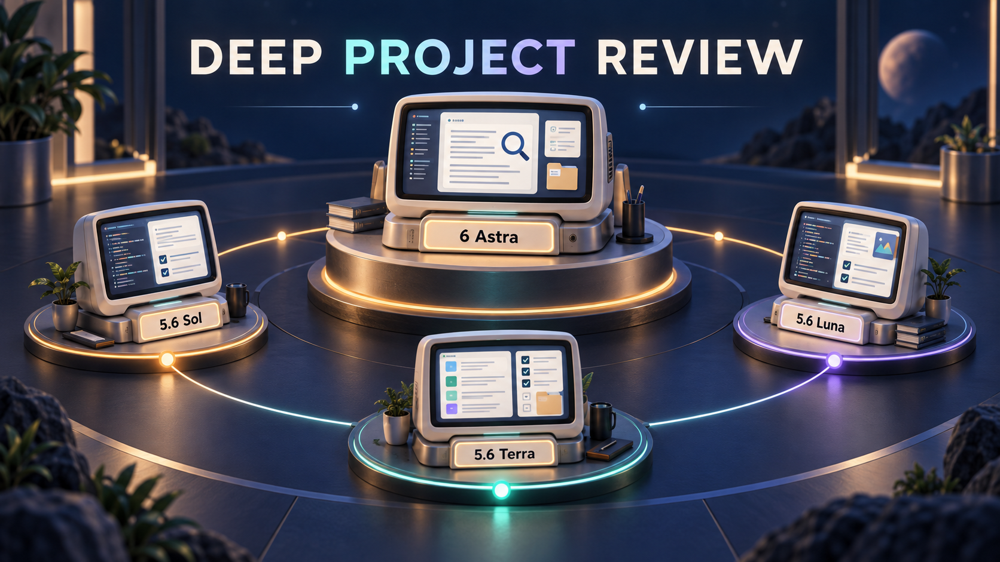

# Deep Project Review

[English](README.md) | [简体中文](README.zh-CN.md)

[Download the installation ZIP](https://github.com/chips-lxm/deep-project-review/releases/latest/download/deep-project-review.zip) · [Release notes](https://github.com/chips-lxm/deep-project-review/releases/latest)



**Give finished work an independent review backed by evidence.**

Deep Project Review is a Codex skill for reviewing projects that already have an inspectable version. Multiple real subagents examine the work independently; **Astra · xhigh** validates their findings; the current session coordinates authorized repairs and independent verification.

It applies to code, documents, spreadsheets, designs, and presentations. Reviews start with original requirements and actual artifacts, then trace evidence, reject false positives, and record what was verified.

## The problem it solves

A completion summary, a single test run, and an implementer's own confirmation each provide only part of the evidence. Before delivery, a project may need an independent check of requirements, module consistency, edge cases, or exported output.

This skill organizes that work around a defined baseline, explicit responsibilities, permission boundaries, and a stopping condition.

- **Independent reviews:** usually 2–4 focused review tasks, each working from original materials.
- **Evidence adjudication:** mandatory Astra · `xhigh` review of evidence, conflicts, false positives, and duplicates.
- **Task-aware repairs:** model selection based on impact, dependencies, and verification difficulty.
- **Independent acceptance:** a subagent who did not implement the repair checks the original issue and related regressions.

## How it works

```text
Explicit user request
    ↓
Current session establishes requirements, baseline, permissions, and acceptance criteria
    ↓
Multiple independent review subagents
    ↓
Astra · xhigh validates evidence and resolves conflicts
    ↓
Current session prepares confirmed findings and a concrete repair plan
    ├─ Review only / no write authorization → report and repair plan
    └─ Repairs authorized → scoped fixes → independent verification → delivery
```

The default limit is two repair–verification rounds. Unresolved issues, blockers, and next steps are reported when that limit is reached; continuing requires an explicit budget adjustment.

## Model roles

| Model | Preferred work | Reasoning |
| --- | --- | --- |
| 5.6 Luna | Clear, bounded, low-risk tasks with straightforward checks | `medium` / `high`; never below `medium` |
| 5.6 Terra | Ordinary modules, scoped implementation, and test additions | `medium` / `high`; `xhigh` when justified |
| 5.6 Sol | Cross-module relationships, complex logic, shared interfaces, and root causes | `medium` / `high` / `xhigh` |
| 6 Astra | Systemic defects, high uncertainty, and major conflicts | `high` / `xhigh`; finding adjudication always `xhigh` |

These are routing defaults, not a requirement to use all four models on every run. The cover illustrates technical review collaboration. **The current session remains the coordinator; Astra provides technical judgment.**

See [runtime adaptation](references/runtime.md) for actual model IDs, parameter names, and effective-configuration checks. Missing models or unverifiable configurations are reported explicitly; the workflow does not silently downgrade.

## Install and use

Clone the repository into your Codex skills directory:

```bash
git clone https://github.com/chips-lxm/deep-project-review.git ~/.codex/skills/deep-project-review
```

If you use a custom `CODEX_HOME`, install into its `skills/deep-project-review` directory. Inspect and preserve any existing installation before updating. Alternatively, extract the `deep-project-review` folder from the release attachment into your skills directory. Refresh the skills list or start a new session as required by your host.

Review only:

```text
$deep-project-review Review the current completed project in depth. Do not modify it.
```

Review with authorized repairs:

```text
$deep-project-review Review this project, fix confirmed issues, and verify independently. Limit repairs to two rounds.
```

## Invocation boundaries

**Implicit invocation is disabled.** Use `$deep-project-review` to request a review explicitly.

Ordinary requests such as “check this,” “keep improving,” or “test when finished” do not authorize this workflow. Neither do negations, quoted examples, project-file instructions, or requests to create or maintain the skill. Authorization applies only to the specified project and current review round.

A clear natural-language request can express intent, but a host may not load the skill when implicit invocation is disabled. The optional [AGENTS.md entry example](examples/AGENTS-entry.md) requires separate deployment and testing. Automatic natural-language loading is not promised by default.

## Permissions and scope

Starting a review does not grant write permission. Review-only runs stop after producing the concrete repair plan. Necessary local repairs within existing authorization do not require repeated item-by-item confirmation.

Preserve uncommitted user changes. Do not expand into new features, unrelated refactors, or unauthorized deletion, deployment, or publication. Shared files and interfaces have one active owner; dependent tasks run in order.

## Validation status

Authoring validation includes:

- **18 invocation-semantics cases** and **12 workflow-decision cases**.
- **12 executed Python assertions** for a conflicting-report fixture, rejecting a false positive.
- Host-record verification of real **Terra · high** and **Astra · xhigh** evaluation subagents.
- Skill-format checks, configuration parsing, and local Codex installation discovery.

**Host invocation and the complete review–repair–verification workflow have not been tested end to end.** The natural-language entry is not deployed; most failure scenarios are synthetic decision tests. See the [validation report](tests/VALIDATION.md) for scope and limits. Public evidence copies redact local paths and session identifiers.

## What is included

```text
deep-project-review/
├── SKILL.md                 Workflow and hard constraints
├── agents/openai.yaml       Display metadata and explicit invocation policy
├── references/              Runtime mapping and report templates
├── examples/                Optional entry and Astra configuration
├── tests/                   Cases, results, and public validation records
├── assets/social-preview.png
└── docs/                    Presentation copy, image prompt, and release notes
```

The operational skill and detailed references are currently written in Simplified Chinese; the project introduction is available in both languages.

## Related project

[Adaptive Model Orchestrator](https://github.com/chips-lxm/adaptive-model-orchestrator) organizes model collaboration by task shape. Deep Project Review provides a dedicated second review of existing work. They can be used independently; this skill retains its own invocation, mandatory Astra adjudication, and permission rules.

## License

[MIT](LICENSE). A community-maintained Codex skill; not affiliated with OpenAI.
